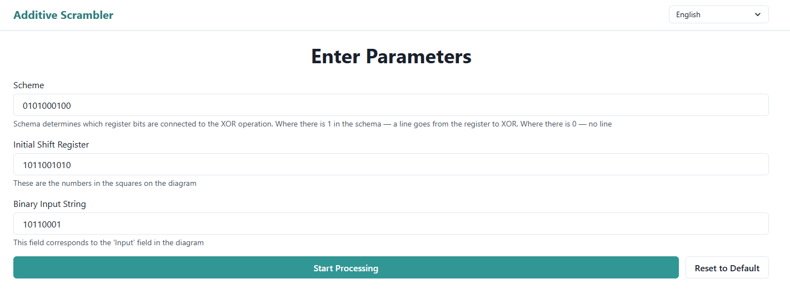
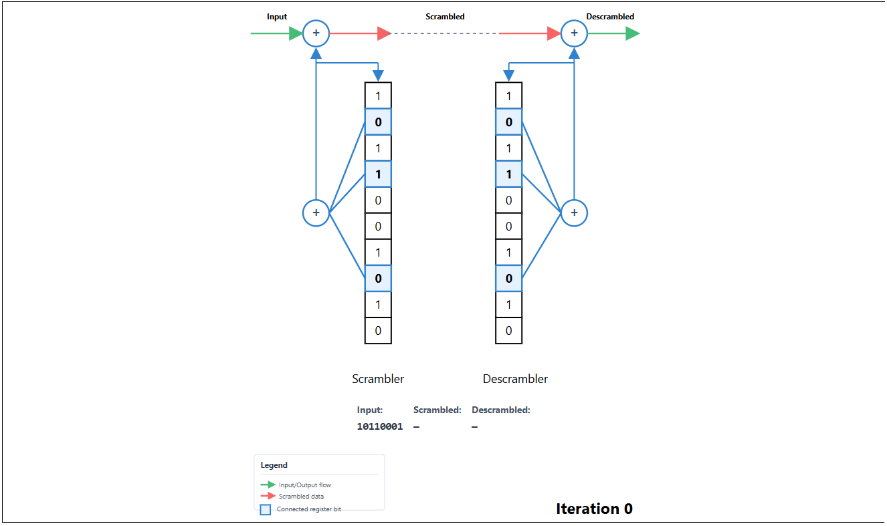
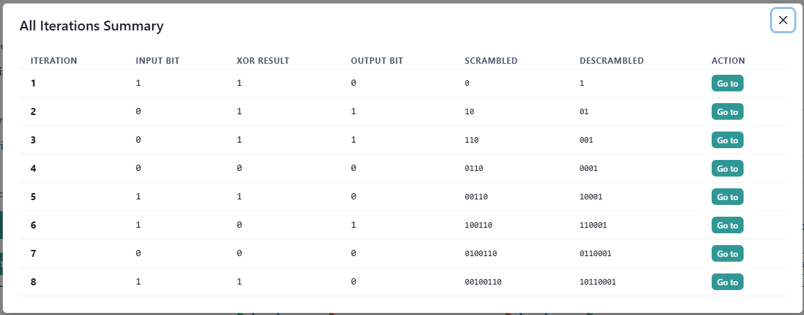
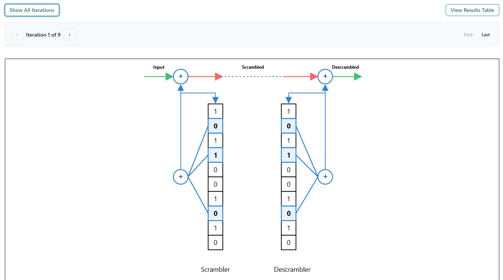

# 🔀 Additive Scrambler Visualizer


**Interactive visualization tool for additive scrambler and descrambler with step-by-step binary sequence processing using shift registers and XOR operations**

🌐 **Live Demo:** [View on GitHub Pages](https://siris1b.github.io/Additive-Scrambler-Visualizer/)

---

## 📸 Screenshots & Demo

### Main Interface

<div align="center">
  
</div>

### Diagram Visualization

<div align="center">
  
</div>

### Results Table

<div align="center">
  
</div>

### Navigation Mode

<div align="center">
  
</div>

---

## 📋 Table of Contents

- [Overview](#-overview)
- [What is an Additive Scrambler?](#-what-is-an-additive-scrambler)
- [Features](#-features)
- [Tech Stack](#-tech-stack)
- [Installation](#-installation)
- [Usage](#-usage)
- [Project Structure](#-project-structure)
- [Development](#-development)
- [FAQ](#-faq)
- [Contributing](#-contributing)
- [License](#-license)
- [Author](#-author)

---

## 🎯 Overview

### What is this?

Additive Scrambler Visualizer is an educational web application that provides an interactive, step-by-step visualization of how additive scramblers and descramblers process binary sequences. It demonstrates the internal workings of shift registers, XOR operations, and the scrambling/descrambling process in real-time.

### Why is this needed?

Understanding additive scramblers can be challenging due to the abstract nature of binary operations and shift register mechanics. This tool bridges that gap by providing:

- **Visual Learning**: See exactly how each bit flows through the system
- **Step-by-Step Processing**: Understand each iteration with detailed diagrams
- **Interactive Experience**: Modify inputs and see results instantly
- **Educational Value**: Perfect for students learning digital signal processing

### Who is this for?

- **Students** studying digital signal processing, telecommunications, or computer engineering
- **Educators** teaching binary operations and scrambling algorithms
- **Developers** who need to understand or implement scrambling logic
- **Anyone** curious about how data scrambling works

---

## 🔧 What is an Additive Scrambler?

An **additive scrambler** (also known as a linear feedback shift register scrambler) is a device used in telecommunications and data transmission to randomize binary data streams. Here's how it works:

### Basic Principle

1. **Shift Register**: A series of storage elements (bits) that can shift their contents
2. **XOR Operations**: Combines selected register bits using exclusive-OR logic
3. **Feedback Loop**: The XOR result is fed back into the register while also being XORed with the input bit
4. **Output**: The scrambled bit is the XOR of the input bit and the feedback

### Key Components

- **Schema**: A binary pattern defining which register positions are "tapped" for XOR
- **Initial Register**: The starting state of the shift register
- **Input Stream**: The binary sequence to be scrambled

### Scrambling Process

```
Input Bit → XOR with Feedback → Output Bit (Scrambled)
                ↓
         Feedback to Register
                ↓
         Shift Register Updates
```

The descrambler uses the same structure but operates in reverse, recovering the original data from the scrambled stream.

---

## ✨ Features

- 🎨 **Interactive SVG Diagrams**: Beautiful, color-coded visualizations of the scrambler/descrambler state
- 📊 **Step-by-Step Processing**: View each iteration with detailed register states and XOR results
- 🔄 **Real-time Visualization**: See how bits flow through the system in real-time
- 🌐 **Bilingual Support**: English and Ukrainian language support
- 🎯 **Input Validation**: Built-in validation with helpful error messages
- 📱 **Responsive Design**: Works on desktop and tablet devices (minimum width: 768px)
- 🎭 **Multiple View Modes**: View all iterations at once or navigate one by one
- 📋 **Results Table**: Comprehensive table view of all processing steps
- 🔍 **Visual Indicators**: Color-coded arrows and connections show data flow
- ⚡ **Performance Optimized**: Memoized components and efficient rendering

---

## 🛠 Tech Stack

| Category               | Technology             | Purpose                            |
| ---------------------- | ---------------------- | ---------------------------------- |
| **Frontend Framework** | React 18.3.1           | Component-based UI                 |
| **Language**           | TypeScript 5.6.3       | Type safety and better DX          |
| **UI Library**         | Chakra UI 2.10.3       | Modern, accessible components      |
| **Form Handling**      | React Hook Form 7.69.0 | Efficient form management          |
| **Validation**         | Zod 4.3.4              | TypeScript-first schema validation |
| **Animations**         | Framer Motion 11.11.9  | Smooth transitions and animations  |
| **Build Tool**         | Vite 5.4.8             | Fast development and build         |
| **Styling**            | Emotion                | CSS-in-JS for Chakra UI            |

### Why these technologies?

- **React + TypeScript**: Provides type safety and excellent developer experience
- **Chakra UI**: Beautiful, accessible components with great documentation
- **React Hook Form + Zod**: Declarative, performant form validation
- **Vite**: Lightning-fast development server and optimized builds
- **Framer Motion**: Smooth, professional animations without performance overhead

---

## 📦 Installation

### Prerequisites

- **Node.js** 18.x or higher
- **npm** 9.x or higher (or yarn/pnpm)

### Step-by-Step Setup

1. **Clone the repository**

   ```bash
   git clone https://github.com/Siris1B/Additive-Scrambler-Visualizer.git
   cd Additive-Scrambler-Visualizer
   ```

2. **Install dependencies**

   ```bash
   npm install
   ```

3. **Start the development server**

   ```bash
   npm run dev
   ```

4. **Open your browser**
   - Navigate to `http://localhost:5173` (or the port shown in terminal)
   - The app should now be running!

### Build for Production

```bash
npm run build
```

The built files will be in the `dist/` directory.

### Preview Production Build

```bash
npm run preview
```

---

## 🚀 Usage

### Basic Usage

1. **Enter Parameters**

   - **Scheme**: Binary string defining register taps (e.g., `1011`)
   - **Initial Shift Register**: Starting state of the register (e.g., `1011`)
   - **Binary Input String**: The data to scramble (e.g., `11001100`)

2. **Click "Start Processing"**

   - The application will process each bit from right to left (LSB first)

3. **View Results**
   - **Initial Diagram**: Shows the starting state (iteration 0)
   - **Iteration Diagrams**: One diagram per input bit showing the processing steps
   - **Results Table**: Click "Show Results Table" for a comprehensive view

### Understanding the Diagram

The SVG diagram shows:

- **Green Arrows**: Input/output data flow
- **Red Arrows**: Scrambled data transmission
- **Blue Connections**: Register bits connected to XOR gates
- **Blue Squares**: Connected register positions (highlighted)
- **XOR Gates**: Circles with "+" symbol showing XOR operations

### Navigation Modes

- **Show All Iterations**: View all diagrams at once (default)
- **Show One Iteration**: Navigate through iterations one by one
  - Use Previous/Next buttons
  - Jump to First/Last iteration
  - Click on table rows to jump to specific iterations

### Example

**Input:**

- Schema: `1011`
- Register: `1011`
- Input: `1100`

**Result:**

- Processed bit by bit from right to left
- Each iteration shows register state, XOR result, and output
- Accumulated scrambled and descrambled strings are displayed

---

## 📁 Project Structure

```
Additive-Scrambler-Visualizer/
├── public/                 # Static assets
│   └── vite.svg
├── src/
│   ├── assets/            # Images and other assets
│   ├── components/        # React components
│   │   ├── ScramblerDiagram/  # Diagram components
│   │   │   ├── ScramblerDiagram.tsx
│   │   │   ├── DataFlow.tsx
│   │   │   ├── ShiftRegister.tsx
│   │   │   ├── XorGate.tsx
│   │   │   ├── Connection.tsx
│   │   │   ├── IterationLabel.tsx
│   │   │   └── DiagramLegend.tsx
│   │   ├── ScramblerForm.tsx
│   │   ├── IterationList.tsx
│   │   ├── IterationNavigation.tsx
│   │   ├── ResultsTable.tsx
│   │   ├── Header.tsx
│   │   ├── ErrorBoundary.tsx
│   │   └── MinWidthWarning.tsx
│   ├── contexts/          # React contexts
│   │   └── LanguageContext.tsx
│   ├── hooks/             # Custom React hooks
│   │   └── useMinWidthCheck.ts
│   ├── locales/           # Translation files
│   │   ├── en.json
│   │   └── uk.json
│   ├── utils/             # Utility functions
│   │   ├── constants.ts
│   │   ├── types.ts
│   │   ├── validation.ts
│   │   ├── validationSchema.ts
│   │   └── scrambler.ts
│   ├── App.tsx            # Main application component
│   └── main.jsx           # Application entry point
├── .gitignore
├── index.html
├── LICENSE
├── package.json
├── tsconfig.json
└── vite.config.js
```

### Key Directories

- **`src/components/`**: All React components organized by feature
- **`src/utils/`**: Core business logic (scrambler algorithm, validation)
- **`src/locales/`**: Internationalization translations
- **`src/contexts/`**: React context providers
- **`src/hooks/`**: Reusable custom hooks

---

## 💻 Development

### Available Scripts

```bash
# Start development server
npm run dev

# Build for production
npm run build

# Preview production build
npm run preview

# Run linter
npm run lint

# Type checking (without compilation)
npm run typecheck
```

### Development Guidelines

1. **TypeScript**: All new code should be in TypeScript with proper types
2. **Component Structure**: Keep components small and focused
3. **Code Style**: Follow existing patterns and use ESLint
4. **Testing**: Write tests for utility functions (when tests are added)

### Code Organization

- **Components**: Keep presentation logic separate from business logic
- **Utils**: Pure functions in `utils/`, no side effects
- **Types**: All TypeScript types/interfaces in `utils/types.ts`
- **Constants**: Magic numbers and configuration in `utils/constants.ts`

---

## ❓ FAQ

### What is the minimum screen width?

The application requires a minimum width of **768 pixels**. This ensures the SVG diagrams display correctly. On smaller screens, a warning message is shown.

### How does the descrambler work?

The descrambler uses the same structure as the scrambler. It receives the scrambled bits, performs XOR with the feedback from its register, and outputs the descrambled bit. The register is shifted with the feedback value, allowing self-synchronization.

### Why is processing done right-to-left?

This follows the LSB (Least Significant Bit) first convention, which is common in many digital systems and standards.

### Can I use custom register lengths?

Yes! As long as the schema and register have the same length, you can use any size. However, larger registers will create taller diagrams.

### Is the code self-synchronizing?

The current implementation demonstrates the scrambling/descrambling process. The descrambler uses the same initial register as the scrambler by default, but the architecture supports self-synchronization.

### What happens if I enter invalid input?

The form validation will prevent submission and show helpful error messages. Only binary strings (0 and 1) are accepted, and schema/register lengths must match.

---

## 🤝 Contributing

Contributions are welcome! Here's how you can help:

### How to Contribute

1. **Fork the repository**
2. **Create a feature branch**
   ```bash
   git checkout -b feature/amazing-feature
   ```
3. **Make your changes**
   - Follow the existing code style
   - Add comments for complex logic
   - Update documentation if needed
4. **Commit your changes**
   ```bash
   git commit -m 'Add some amazing feature'
   ```
5. **Push to the branch**
   ```bash
   git push origin feature/amazing-feature
   ```
6. **Open a Pull Request**

### Contribution Guidelines

- Write clean, readable code
- Add JSDoc comments for functions/components
- Test your changes thoroughly
- Update README if adding new features
- Follow TypeScript best practices

### Areas for Contribution

- 🐛 Bug fixes
- 📚 Documentation improvements
- 🎨 UI/UX enhancements
- ⚡ Performance optimizations
- 🌐 Additional language translations
- 🧪 Test coverage

---

## 📄 License

This project is licensed under the **MIT License** - see the [LICENSE](LICENSE) file for details.

---

## 👤 Author

**Siris1B**

- GitHub: [@Siris1B](https://github.com/Siris1B)
- Project: [Additive Scrambler Visualizer](https://github.com/Siris1B/Additive-Scrambler-Visualizer)

---

## 🙏 Acknowledgments

- **Chakra UI** team for the excellent component library
- **React** team for the amazing framework
- **Vite** team for the fast build tool
- Educational resources on digital signal processing that inspired this project
- Open source community for the amazing tools and libraries

---

## 📝 Notes

- This is an educational tool designed to help understand additive scramblers
- For production use cases, ensure proper error handling and validation
- The visualization is optimized for educational clarity over absolute accuracy in all edge cases

---

**⭐ If you find this project helpful, consider giving it a star!**
